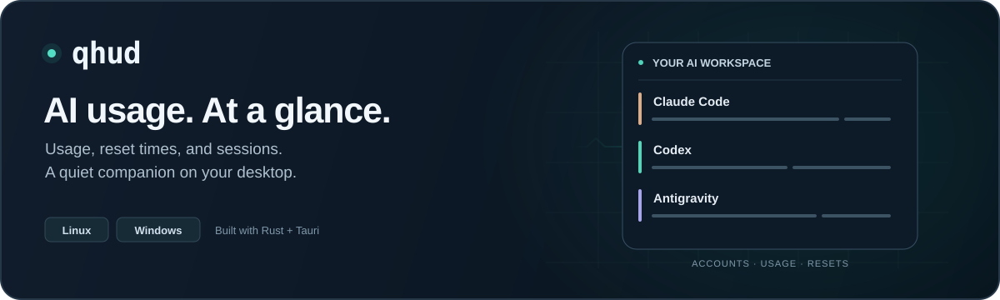

<div align="center">
  
</div>

<div align="center">
  <a href="https://github.com/chquandogong/qhud/releases"></a>
  <a href="LICENSE"></a>
  
  
  <a href="https://github.com/chquandogong/qmonster"></a>
</div>

## What it is

A small always-there panel on your desktop wallpaper that answers one
question without you switching to anything: **how much room is left on each
AI CLI account, and when does it reset?**

If you run Claude Code, Codex and Antigravity side by side — and especially
if you hold more than one account per provider — the answer normally lives
in three different TUIs behind three different keystrokes. qhud puts it in
one place, below your windows, always visible.

It is a second frontend for [qmonster](https://github.com/chquandogong/qmonster):
the observation pipeline is qmonster's, re-rendered as a desktop widget.

<div align="center">
  
  &nbsp;&nbsp;
  
</div>

## What it shows

```
CLAUDE
  chquan@dogu.xyz     team (max_5x)  extra $0.00       ⟳
    5H        ███░░░░░░░   8%   resets 2h10m
    7D        ██░░░░░░░░  15%   resets 5d
    Fable wk  ██░░░░░░░░  22%   resets 5d
  me@gmail.com        pro (max_20x)         ⟳ 12m ago
    5H        ████░░░░░░  42%   resets 1h03m
CODEX
  chquan17@gmail.com  ChatGPT Pro 5x    2 ws · ⟳ 3m ago
    ↳ personal        ████████░░  80%   resets 3d
AGY
  chquan17@gmail.com  Google AI Pro                    ⟳
    5H        ░░░░░░░░░░   0%   resets 4h
    7D        ░░░░░░░░░░   0%   resets 6d
    3p 5h     ░░░░░░░░░░   0%   resets 4h
⌵ 4 accounts need auth
```

Provider is the outer axis — it is what you pick when deciding where to run
the next task. Under it sit the accounts (with their plans) — **several per
provider** if you keep each signed in under its own config dir — and under
each one gauge per window. Every number that did not come from a live pane
wears its provenance (`⟳ 12m ago` for qhud's own last refresh, `~22h old`
for the CLI's cache), so a stored reading can never pass for a live one.
Below the live rows, accounts you have connected before but that have no
usable credential right now collapse into one line: their quota is still
being consumed, so hiding them would be a lie of omission.

Per-pane tiles underneath show status, context pressure, model, effort,
branch, cwd, memory, cost, and cross-pane file conflicts.

## Where the numbers come from

This is the part worth reading, because the honest answer differs per
provider and the failure modes are not obvious.

| Provider                      | Source                                                                         | Freshness                           |
| ----------------------------- | ------------------------------------------------------------------------------ | ----------------------------------- |
| Claude 5H / 7D                | statusLine JSON the CLI already writes                                         | live, every prompt                  |
| Claude per-model, extra usage | `GET /api/oauth/usage` on ⟳ — once per signed-in account                       | on ⟳; last result kept dated        |
| Codex                         | `/wham/usage` per credential; `codex app-server` when the active token expired | on ⟳; last result kept dated        |
| Antigravity                   | the CLI's own loopback RPC — no token at all                                   | on ⟳ while agy runs; last read kept |
| Accounts, plans, tiers        | local files the CLIs keep in cleartext                                         | live                                |

**The 2-second poll loop never opens a socket and never touches a
credential.** Everything that reaches further runs from an explicit
gesture — the topbar ⟳ (all providers at once), a row's own ⟳/click, or
their CLI twins — and none of it ever runs an OAuth refresh grant, because
rotating a refresh token out from under your CLI is how you lose a login.
When the Codex token has expired anyway, qhud asks a short-lived
`codex app-server` child instead: the CLI owns its rotation, qhud reads no
token. Every ⟳ result is persisted (dated), so a restart shows the last
thing qhud actually knew instead of a day-old CLI cache.

Claude's per-model windows need that button because nothing else can produce
them: the statusLine feed does not carry them, and nothing qhud can run
refreshes the CLI's on-disk cache (verified — not `--version`, not `doctor`,
not even a real headless `--print`). That cache only moves when you open
`/usage` yourself, which is precisely when you do not need a widget.

## What it cannot do

Stated plainly, because a widget that hides its blind spots is worse than
one that admits them.

- **One live login per provider is the default, not the ceiling** — but
  lifting it is on you: keep each extra Claude account signed in under its
  own dir (`CLAUDE_CONFIG_DIR=~/claude-personal claude`) and list the dir
  in the registry (D-015). Without that, all three CLIs store a single
  active credential and `codex login` revokes the previous token.
- **A pane's account is not attributable**, so pane-fed gauges always land
  on the default account's row — an extra account's numbers come from its
  own snapshot and ⟳ only.
- **agy multi-account is not possible yet** (live token in the OS keyring;
  not reverse-engineered).
- **Codex will not re-scope a token to another workspace.** The
  `chatgpt-account-id` header is ignored; a response describing a different
  workspace is dropped rather than mislabelled. Workspaces of one login are
  covered per credential file; another login needs its own `codex_homes`
  entry.
- **Per-model windows are only as fresh as your last ⟳** — they persist
  across restarts now, but always wearing their age.
- **Wire plan values are not display names.** `prolite` is your _ChatGPT Pro
  5x_, `team` is _ChatGPT Business_. Display names come from your own
  registry file and are never derived from the wire value.

## Install

Prebuilt Linux x86_64 tarball from
[Releases](https://github.com/chquandogong/qhud/releases):

```sh
tar xzf qhud-*-linux-x86_64.tar.gz
install -Dm755 qhud ~/.local/bin/qhud
qhud
```

From source (Rust 1.88+, a WebKitGTK dev environment, and
[qmonster](https://github.com/chquandogong/qmonster)'s own prerequisites):

```sh
cargo build --release --manifest-path src-tauri/Cargo.toml
install -Dm755 target/release/qhud ~/.local/bin/qhud
```

Autostart and an app-grid entry: see [RUNBOOK](docs/05-ops/RUNBOOK.md).

## Using it

| Action                 | How                                                      |
| ---------------------- | -------------------------------------------------------- |
| Move / resize          | drag the top or footer bar; ◢ grip to resize             |
| Zoom                   | Ctrl+wheel over the widget (70–160%, persisted)          |
| Expand a pane          | click its tile                                           |
| Peek above windows     | tray → _Pin above windows_, or `qhud --peek`             |
| Refresh everything     | the ⟳ in the topbar, or `qhud --refresh-all`             |
| Refresh Claude usage   | the ⟳ on a Claude row, or `qhud --refresh-claude`        |
| Fetch Codex workspaces | click the Codex row, or `qhud --fetch-codex`             |
| Read agy quota         | the ⟳ on the agy row (loopback RPC, only while agy runs) |
| Forget an account      | ✕ on its collapsed row                                   |

The widget takes no keyboard focus and is pointer-only by design. Every
network path also has a CLI trigger, because a keep-below window cannot
receive synthesized pointer input — which also makes those triggers
bindable to GNOME shortcuts.

## Accounts and plans

Display names live in `~/.config/qhud/accounts.json`, **outside this
repository on purpose** — it holds your emails and account ids, and this
repo is public. It sets labels and plan text, lists accounts that have ever
connected (so they can appear as placeholders), records the ones you have
dismissed, and — the multi-account part (D-015) — lists the extra config
dirs you keep signed in: `claude_config_dirs` for additional
`CLAUDE_CONFIG_DIR` accounts, `codex_homes` for additional `CODEX_HOME`
credential dirs. qhud's own ⟳ results persist next to it in
`fetched-usage.json` (same privacy rule). Schema and rules:
[RUNBOOK](docs/05-ops/RUNBOOK.md).

## When a number looks wrong

```sh
qhud --dump                                   # the exact payload being rendered
QMONSTER_SIDEFILE_DIAG=1 qhud --dump 2>&1 >/dev/null   # why attribution declined
qhud --claude-usage   qhud --codex-usage   qhud --agy-usage   # each fetch, standalone
qhud --codex-appserver                        # the expired-token fallback, on demand
QHUD_EXTRA_DIAG=1 qhud --claude-usage         # extra-usage shape drift (identity-free)
```

The widget also reports what it built to stderr — the structure it rendered,
the text of every row, and any frontend exception. That exists because the
pixels are not verifiable from outside the webview (`scrot` cannot capture
XWayland-composited windows), so **the absence of an error is not proof
anything painted**.

## Design notes

Decisions and their reasoning live in
[DECISION_LOG](docs/02-decisions/DECISION_LOG.md). The ones that will bite
you if you change this code:

- **D-008** — all window geometry is self-driven; compositor interactive ops
  are not used.
- **D-010** — Ubuntu's desktop-icons extension intercepts real pointer
  input, so input must be verified through the compositor path.
- **D-011** — facts render at the scope where they are true: quota is an
  account fact, not a pane fact.
- **D-012** — **never install Unix signal handlers** in a Tauri/WebKitGTK
  process. JavaScriptCore reserves SIGUSR1 for thread suspension; hooking it
  segfaults the webview.
- **D-013 / D-014** — account identity is read locally only; "no network"
  became "passive by default, network only on request".
- **D-015** — multi-account = per-account CLI config dirs; qhud never owns
  a login or runs a refresh grant.
- **D-016** — the provider's own process may do the talking (`codex
app-server`, agy loopback RPC); credential custody stays with the CLI.

Architecture: [ARCHITECTURE](docs/03-spec/ARCHITECTURE.md) ·
Requirements and payload contract: [SPEC](docs/03-spec/SPEC.md) ·
History: [CHANGELOG](CHANGELOG.md)

## Scope

One workstation, 1–12 AI panes, GNOME/Wayland via XWayland as the primary
target. Other desktops are best-effort. Beyond ~12 panes the interaction
model should change rather than be stretched.

## License

[MIT](LICENSE)
