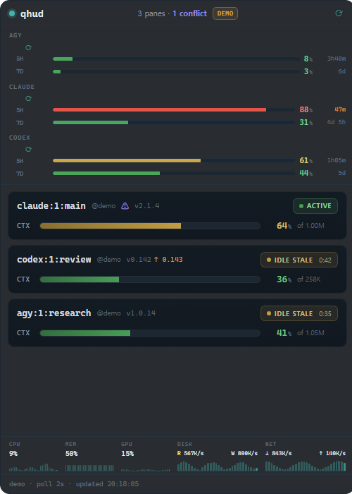
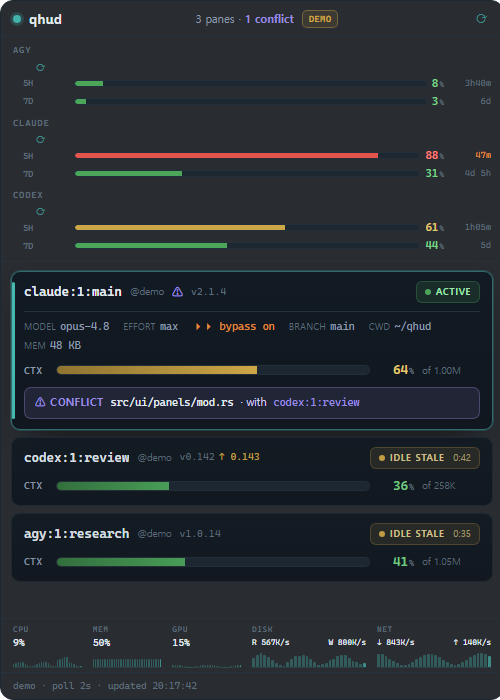

<h1 align="center">qhud</h1>

<p align="center">
  <strong>Ambient desktop HUD for AI CLI sessions — qmonster's second face.</strong>
</p>

<p align="center">
  <a href="https://github.com/chquandogong/qhud/actions/workflows/ci.yml"></a>
  <a href="https://github.com/chquandogong/qhud/releases"></a>
  <a href="LICENSE"></a>
  
  
  
</p>

qhud pins a small, glanceable widget to your **desktop background
layer** — below every window, above the wallpaper, on every workspace
— showing the health of the AI CLIs running in your tmux panes:
per-pane status, context fill, and 5-hour / weekly quota gauges with
reset countdowns. It is a second frontend for
[qmonster](https://github.com/chquandogong/qmonster): same observe
pipeline, zero terminal footprint.

<p align="center">
  
  &nbsp;&nbsp;
  
</p>

## Why

Quota pressure bites precisely when you are _not_ looking at the
monitor pane. A TUI answers questions when you visit it; a HUD answers
them while you work. qhud is the wall-clock version of qmonster:
park it on a spare corner of any monitor and glance.

## Features

- **True desktop-layer widget** — keep-below + sticky + skip-taskbar,
  verified against GNOME Mutter (Wayland session, via XWayland).
- **The qmonster pipeline, unmodified** — links the crate directly;
  identity resolution, provider parsing (Claude / Codex / Gemini /
  Antigravity), signals and cross-pane conflict findings all upstream.
- **Observe-only by contract** — no writes to `~/.qmonster`, no
  notifications, no network. The TUI stays the single writer.
- **Scope-correct display** — account facts once: a per-provider
  5H/7D quota strip using the freshest snapshot across panes;
  pane facts per tile: status pill, CTX gauge, `@workspace` badge,
  click-to-expand config + conflict detail. Severity bands from the
  reference mockup (`<60` ok · `60–74` concern · `75–84` warn ·
  `≥85` crit).
- **Drag anywhere, resize, remembered** — multi-monitor position and
  size persist across restarts.
- **Demo mode** — no tmux? The widget renders the reference mockup
  data with a `DEMO` badge and re-probes for live data every 10 s.
- **15 MB single binary** — Tauri 2, static frontend, no bundler, no
  node_modules.

## Quick start

```bash
# release binary
gh release download --repo chquandogong/qhud --pattern '*linux-x86_64.tar.gz'
tar -xzf qhud-v*-linux-x86_64.tar.gz && ./qhud-v*/qhud &

# or from source
sudo apt-get install -y libwebkit2gtk-4.1-dev libgtk-3-dev \
  libayatana-appindicator3-dev librsvg2-dev pkg-config
git clone https://github.com/chquandogong/qhud && cd qhud
cargo build --release && ./target/release/qhud &
```

Have qmonster set up already? qhud reads the same
`~/.qmonster/config/qmonster.toml` (read-only) and observes the same
tmux panes. No qmonster config? Defaults apply.

Autostart, tray, and troubleshooting (blank window, HiDPI, tray-less
sessions): see the [RUNBOOK](docs/05-ops/RUNBOOK.md).

## How it stays on the desktop layer

GNOME's Wayland compositor has no widget-layer protocol for
third-party apps (`wlr-layer-shell` is
[unimplemented in Mutter](https://gitlab.gnome.org/GNOME/mutter/-/work_items/973)),
and native Wayland windows cannot even position themselves globally.
qhud therefore forces the X11 backend (XWayland) and uses the EWMH
states Mutter _does_ honor — `_NET_WM_STATE_BELOW` + `_STICKY` +
`_SKIP_TASKBAR` — the same mechanism Conky-style widgets have used for
years, applied through Tauri's `alwaysOnBottom`:

```text
_NET_WM_STATE(ATOM) = _NET_WM_STATE_SKIP_PAGER, _NET_WM_STATE_SKIP_TASKBAR,
                      _NET_WM_STATE_BELOW, _NET_WM_STATE_STICKY
_NET_WM_DESKTOP(CARDINAL) = 4294967295        # every workspace
```

On X11 sessions this works natively; on wlroots/KDE you may prefer
`QHUD_NO_X11_FORCE=1` and your compositor's own layering rules. Full
notes in [ARCHITECTURE](docs/03-spec/ARCHITECTURE.md).

## Relationship to qmonster

|         | qmonster                                                        | qhud                                  |
| ------- | --------------------------------------------------------------- | ------------------------------------- |
| Surface | ratatui TUI in a tmux pane                                      | desktop widget on the wallpaper layer |
| Role    | operating console: alerts, recommendations, settings, snapshots | ambient meters: glanceability only    |
| Writes  | owns `~/.qmonster` (sqlite audit, archives)                     | **none** (NoopSink)                   |
| Data    | qmonster observe pipeline                                       | same crate, pinned rev                |

## Documentation

Decision-traceable docs (Quetzalcoatl layout) under [`docs/`](docs/):
[PROJECT_BRIEF](docs/00-overview/PROJECT_BRIEF.md) ·
[FEASIBILITY](docs/01-discovery/FEASIBILITY_REPORT.md) ·
[DECISION_LOG](docs/02-decisions/DECISION_LOG.md) ·
[ALTERNATIVES](docs/02-decisions/ALTERNATIVES.md) ·
[CROSS_VALIDATION_LOG](docs/02-decisions/CROSS_VALIDATION_LOG.md) ·
[SPEC](docs/03-spec/SPEC.md) ·
[ARCHITECTURE](docs/03-spec/ARCHITECTURE.md) ·
[RISK_REGISTER](docs/04-quality/RISK_REGISTER.md) ·
[TEST_PLAN](docs/04-quality/TEST_PLAN.md) ·
[RUNBOOK](docs/05-ops/RUNBOOK.md)

## Roadmap

- Click a tile → focus that tmux pane in your terminal.
- Upstream versioned JSON export shared by TUI + HUD (today: pinned
  crate rev).
- GNOME Shell extension layer for overview-clean pinning.
- Windows (WorkerW) / macOS (desktop window level) backends.

## Scope

qhud renders; it never acts. No actuation, no notifications, no
telemetry. Single-user, local, observe-only — the same conservative
contract as qmonster.

## License

MIT. See [LICENSE](LICENSE).
