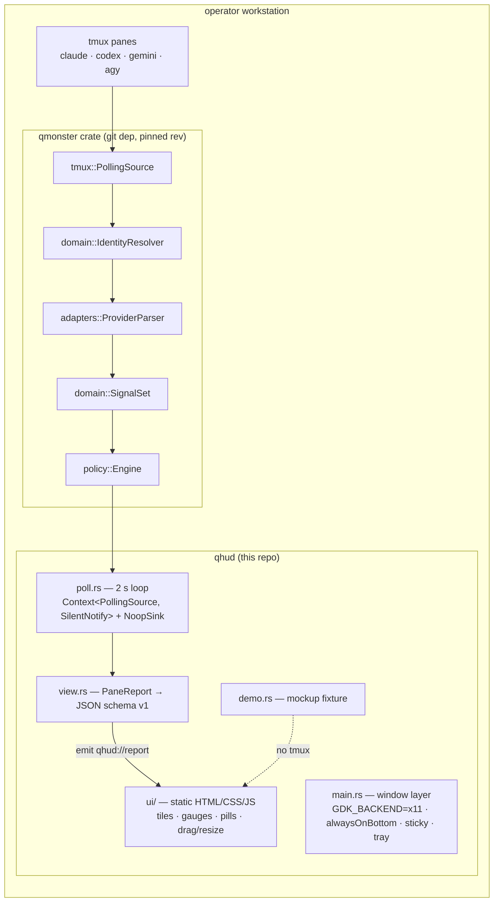

# ARCHITECTURE — qhud

> Status: implemented · Date: 2026-08-05 · Owner: chquandogong

## System view

## Boundaries (non-negotiable)

1. **No writes**: qhud constructs qmonster's `Context` with `NoopSink`
   and `SilentNotify`. `~/.qmonster` belongs to the TUI; qhud reads
   only `config/qmonster.toml`, and only at live-context build time.
2. **Schema v1 is the only interface** the webview sees
   (`view.rs`). qmonster types never cross into JS; upstream refactors
   are absorbed in one file.
3. **Window-layer policy lives in `main.rs` only** (X11 forcing,
   below/sticky asserts). A future layer-shell or Windows/macOS port
   swaps this file, nothing else.
4. **Frontend is dependency-free**: no bundler, no framework; DOM is
   patched in place so the 2 s refresh never restarts CSS animations.

## Module map

| Path                                 | Responsibility                                                      |
| ------------------------------------ | ------------------------------------------------------------------- |
| `src-tauri/src/main.rs`              | process env, window states, tray, thread spawn                      |
| `src-tauri/src/poll.rs`              | live-context lifecycle, 2 s tick, demo fallback, 10 s live re-probe |
| `src-tauri/src/view.rs`              | schema v1 mapping (+ unit tests)                                    |
| `src-tauri/src/demo.rs`              | mockup-parity fixture                                               |
| `ui/index.html · style.css · app.js` | widget rendering, selection, countdown ticker, drag/resize wiring   |

## Runtime knobs

| Env                                | Effect                                                        |
| ---------------------------------- | ------------------------------------------------------------- |
| `GDK_BACKEND` (pre-set)            | respected — qhud only forces `x11` when unset                 |
| `QHUD_NO_X11_FORCE=1`              | never force the backend (e.g. wlroots + native Wayland)       |
| `WEBKIT_DISABLE_DMABUF_RENDERER=1` | WebKitGTK fallback if the webview renders blank (see RUNBOOK) |

## Persistence

- Window geometry: `tauri-plugin-window-state` (app config dir).
- Tile selection: `localStorage` (`qhud.selected`).
- Nothing else — observe-only.
